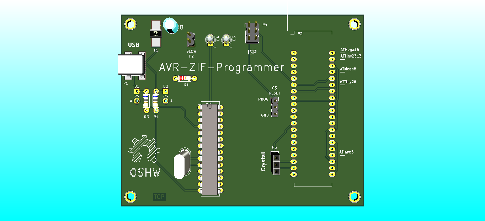
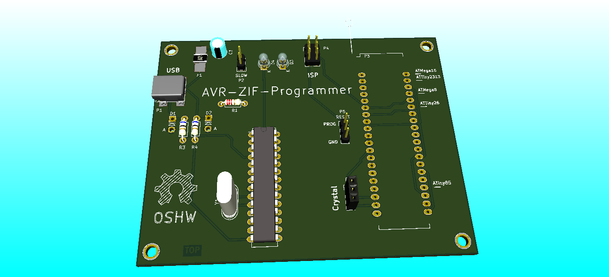
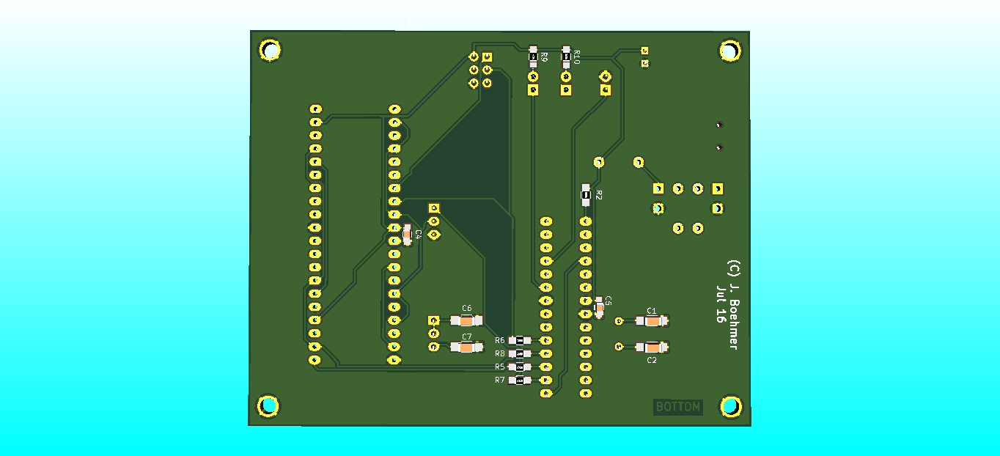

# AVR-ZIF-Programmer

An Universal AVR Programmer with a ZIF-Socket and ISP Header based on [USBasp by Thomas Fischl](http://www.fischl.de/usbasp/).
The PCB was designed in [KiCAD](http://kicad.org/)

## Features:
* based on USBasp by Thomas Fischl
* ISP-Connector on PCB
* can Program many different AVRs:
  * ATMega 164/324/644/1284/16/32
  * ATMega 8/48/88/168/328
  * ATTiny 2313/4313
  * ATTiny 26/261/461/861
  * ATTiny 25/45/85/13
* socket for Crystal/active Clock Source
* main AVR can be updated/reflashed via USB
* LED shows data transfers

## License:
The PCB is licensed under the CERN OHL V1.2, the firmware and bootloader under GPLv2, see License files in the folders for details.

## Instructions
1. Use the Layout files (pcb/ folder) to order a PCB or made one by yourself.

2. Solder all components on it, except the Mega 8. I suggest to solder a socket for it instead. So you can replace it later (in case of wrong programming the "Master" CPU")

3. Put your Mega8 (or 88/168/328) in the ZIF socket in the right position for Mega8. Put the RESET-Jumper P5 in the Position PROG.

4. Now stick another ISP Programmer (you only need to do this once) into the ISP header on the board and flash the USBasp-Bootloader (bootloader/ folder) on it.

5. Put the flashed Mega 8 in its socket and stick an Jumper on the SLOW Header P2 and connect the board to the PC.

6. The Mega8 will be now in a bootloader mode, where it simulates an USBasp which flashes its own MCU. Use this "bootloader-USBasp" to flash the real USBasp Firmware (firmware/ folder). Now disconnect the SLOW-Header and reconnect the USB. Set the RESET-Header P5 into the GND Position.

Now you can use the board to flash other AVRs. With the RESET-Header P5 you can set if the RESET of the Target MCU should be controled from the Programmer or should be permanent on GND. I suggest using the GND position, so that the flashed MCU wont be damaged through short circuits (some Pins are connected to GND or VCC and the AVR would be damaged if it set that pins for example OUTPUT-HIGH on a GND-Pin).

When you want to flash an AVR that needs Crystal for Programming, you can stick one into the Crystal header P6. You can also connect an active Clock source in this, if you need it.

With setting SLOW-Header P2, you put the Mega8 into a bootloader mode, where you can reflash/update it.

## Gallery
### Renderings

## Links
[Hackaday.io](https://hackaday.io/project/9060-avr-zif-programmer) Page (for more infos and build instructions).
